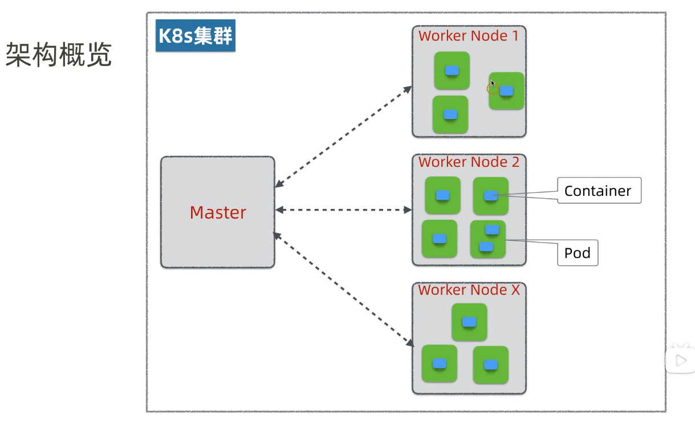
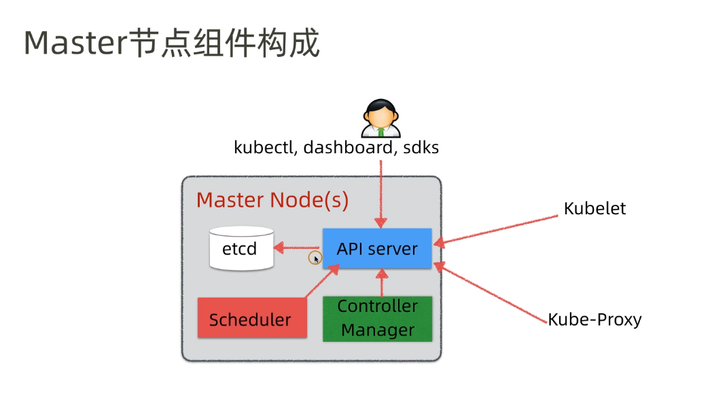
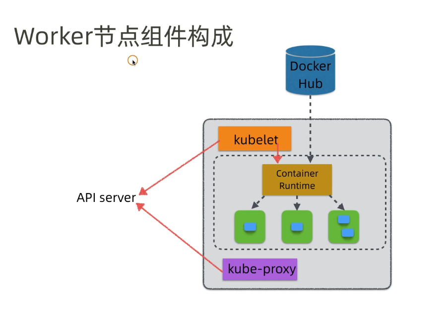
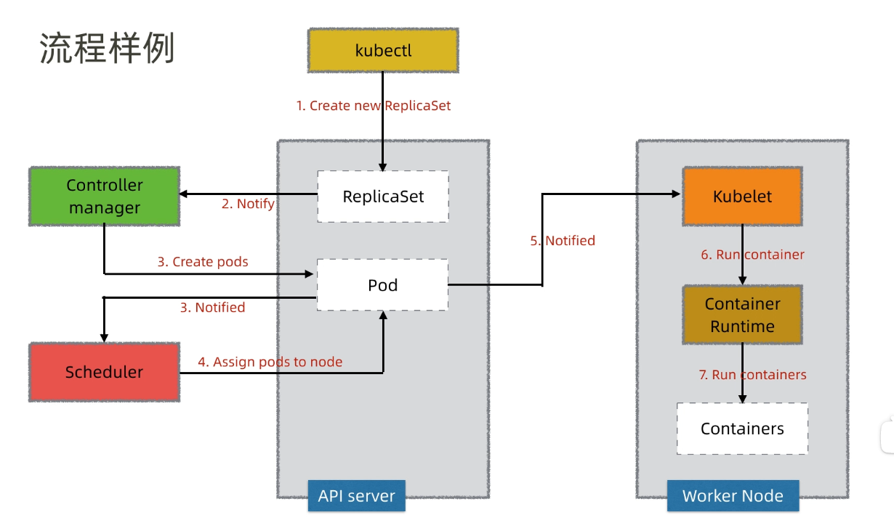
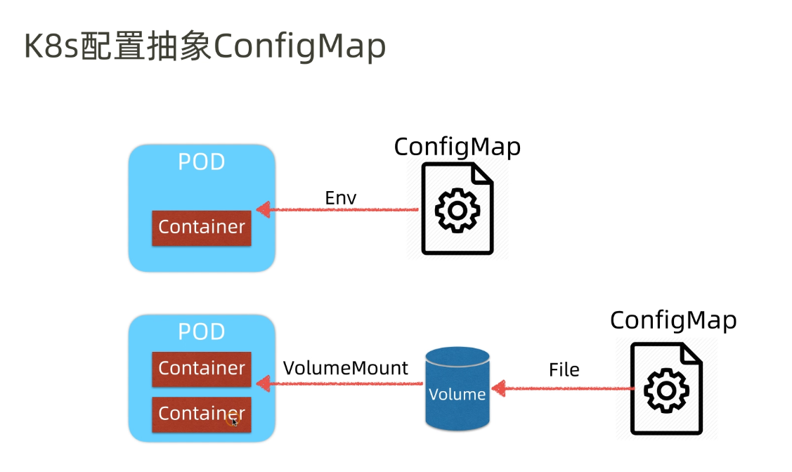

# K8S之ConfigMap

## K8S架构

### 架构概览




### Master节点




### Worker节点




### 组件作用


| 组件               | 节点               | 作用                                                   |
| ------------------ | ------------------ | ------------------------------------------------------ |
| Etcd               | Master or 独立集群 | 集群状态集中存储                                       |
| API Server         | Master             | 集群接口和通讯总线                                     |
| Scheduler          | Master             | 调度决策组件（发布到那些空闲节点）                     |
| Controller Manager | Master             | 协调发布状态最终一致组件                               |
| Kubelet            | Worker             | Worker节点资源管理                                     |
| Container Runtime  | Worker             | 容器资源管理                                           |
| Kube-Proxy         | Worker             | 实现服务（Service）抽象组件，屏蔽PodIP的变化和负载均衡 |
| Pod                | Worker             | k8s云平台中提供的虚拟机，k8s基本调度单位               |
| Container          | Worker             | 应用跑在容器中，资源隔离单位                           |


### 流程样例




## K8S配置抽象ConfigMap




- ConfigMap 时K8S提供的一种**配置抽象管理**，便于在微服务间共享配置
- ConfigMap可以绑定到POD的**环境变量(ENV)**中，配置更新传播
  1. 需要重启POD
  2. 建议更新ConfigMap的name和引用
- ConfigMap也可绑定到POD的**持久卷(Volume)**，支持**配置热更新**


```shell
# 按照资源文件发布configmap
kubectl apply -f xxx-configmap.yaml

# 到pod里面查看环境变量
kubectl exec PodID printenv


```

